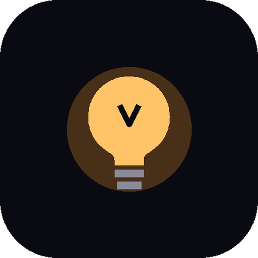
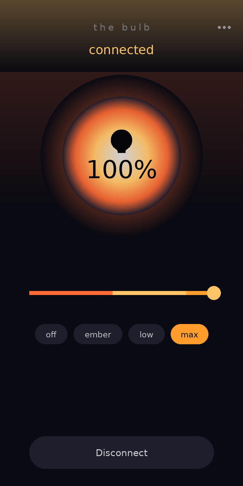

# aBulb



Control a Bluetooth-mesh bulb straight from your phone — no hub, no cloud, no account.

aBulb speaks to the bulb's radio itself: it joins the mesh as a proxy client and drives the standard
Light Lightness model. It can also provision a factory-fresh bulb on its own.

- 2.5 MB to download; ~12.5 MB once installed, which is what Android reports after extracting the APK
  and compiling its code for your device
- Android 8.0+ (API 26)
- No network permission at all. On Android 11 and older it also asks for location, which is what those
  Android versions require to scan for Bluetooth devices — it's never used for anything else
- Tested against a LEDVANCE Smart+ bulb

## Install

1. Download `app-release.apk` from [Releases](../../releases) and install it.
2. Get connected, either way round:
   - **Pair a new bulb.** It must be unprovisioned: power-cycle it 6 times quickly (off 1s, on 1s,
     repeat). Then **⋯ → Pair a new bulb**. The app creates the network, provisions the bulb over GATT
     and keeps the keys.
   - **Import keys from an existing network.** **⋯ → Keys & sharing** → paste the network, app and
     device keys, or import an `abulb-keys.json`. Keys come from the nRF Mesh app's network export, any
     other provisioner's state file, or another aBulb install.
3. Keep the bulb powered — it only advertises the mesh proxy while it has power. The app connects by
   itself and the orb shows the current level.

## Using it



- Drag the slider, or tap a preset — **off / ember / low / max**. Changes are sent as you drag.
- **Double-tap the orb** to toggle between off and the last level it was lit at.
- **⋯** holds keys and sharing, pairing, disconnect, and diagnostics: the mesh address this install
  uses and whether the bulb is answering.

## Two phones, one bulb

Writes are not exclusive: any device holding the keys can address the bulb, and it obeys the most
recent message. The *radio* is exclusive — a bulb's proxy accepts one connection at a time. aBulb
handles that by itself: it holds the link while you're changing the level, gives it back a few seconds
after your last change (or as soon as you leave the app), and silently takes it again when you change
the level or come back. The screen keeps reading *connected* throughout; only the radio is shared.
For two genuinely simultaneous links, add a second always-powered mesh node.

## Troubleshooting

- **Bulb ignores your changes.** If a change goes unanswered for a few seconds, the app re-joins under
  a fresh mesh source address by itself — that clears a stale replay-protection entry at the bulb.
  **Fix link** does the same thing on demand. If neither helps, your keys are for a different network:
  import them again, or re-pair the bulb.
- **"Proxy not found"** — the bulb isn't advertising; power it up and keep it powered.
- **Timeout or "Decryption failed"** — the keys belong to another network.
- **Crashes** — the app shows the previous crash's stack trace on the next start; open an issue with it.

## Build

```bash
sdk.dir=/path/to/Android/sdk   # local.properties
./gradlew :app:assembleRelease
```

Every push to `main` builds an APK as a workflow artifact, and every `v*` tag publishes a
[release](../../releases) with the APK attached. That APK is keyless: it carries no credentials, which
is why you pair a bulb or import your own keys on first run.

Built on Nordic's `mesh:3.3.7` (provisioner and Mesh Profile) and `ble:2.6.1` (proxy GATT client).
Proxy service `0x1828` with `0x2ADD`/`0x2ADE`; provisioning service `0x1827`.

## Privacy

No analytics, no network permission, no account. Keys are kept in the app's private storage on your
phone.

## License

MIT — see LICENSE.
